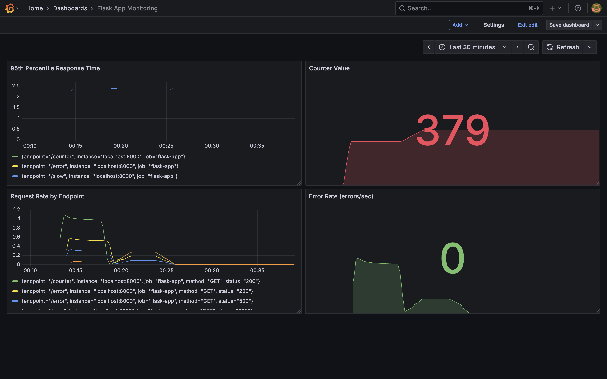

# Prometheus Demo API

A Flask REST API instrumented with Prometheus metrics for monitoring and observability practice.

## Features

- 4 endpoints with different behaviors (normal, slow, error-prone, counter)
- Prometheus client library integration
- Custom metrics: request counts, response times, error rates
- Grafana dashboard for visualization

## Metrics Tracked

- `app_requests_total`: Total number of requests by endpoint, method, and status
- `app_requests_duration_seconds`: Request latency histogram
- `app_active_requests`: Number of concurrent requests
- `app_counter_value`: Counter value gauge

## Endpoints

- `/` - Simple hello response
- `/counter` - Increments and returns a counter value
- `/slow` - Responds with random delay (0.1-2 seconds)
- `/error` - Fails randomly 30% of the time

## Setup

```bash
python3 -m venv venv
source venv/bin/activate
pip install -r requirements.txt
python app.py
```

Access the API at http://localhost:8000

Access metrics at http://localhost:8000/metrics

## Prometheus Configuration

Add to `prometheus.yml`:

```yaml
scrape_configs:
  - job_name: 'flask-app'
    scrape_interval: 5s
    static_configs:
      - targets: ['localhost:8000']
```

Start Prometheus:

```bash
./prometheus --config.file=prometheus.yml
```

## Grafana Dashboard

The dashboard includes 4 panels:
- Request Rate by Endpoint
- Error Rate (errors/sec)
- 95th Percentile Response Time
- Counter Value



## Technologies

- Python 3.13
- Flask
- prometheus-client
- Prometheus
- Grafana